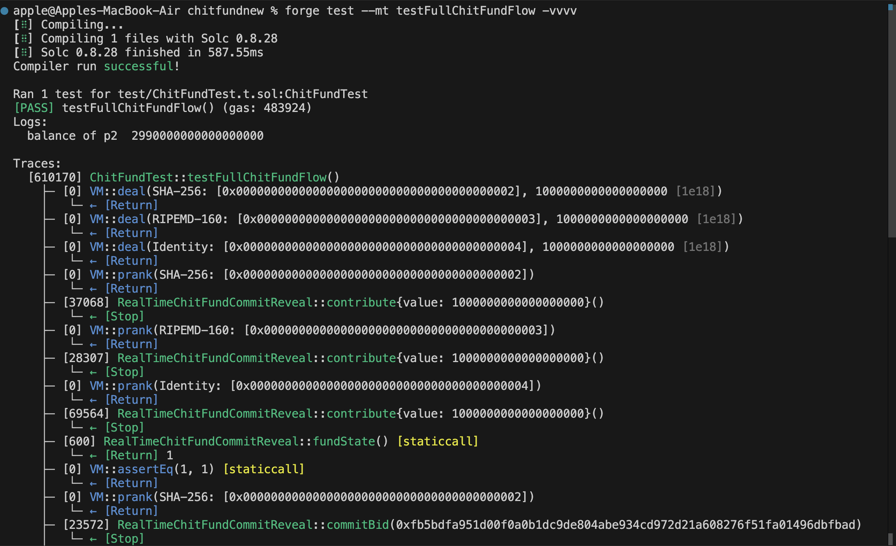
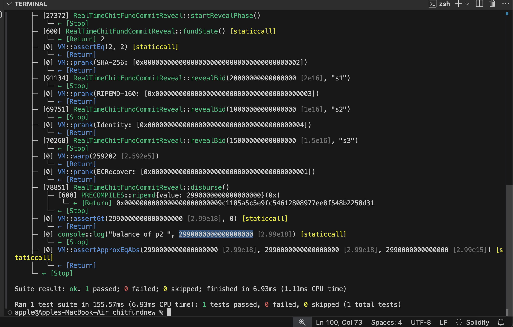

# RealTimeChitFundCommitReveal – Contract Documentation

## Overview

`RealTimeChitFundCommitReveal` is a decentralized chit fund implementation on Ethereum using a **commit-reveal auction mechanism** to fairly select a fund recipient in each round. It integrates ERC20-based registration and Ether-based contribution logic.

---

## Key Components

### Roles

* **Admin**: Deploys the contract, starts reveal phase, and disburses the fund.
* **Participants**: Users who join the fund by paying a registration fee in ERC20 tokens and contribute Ether in each round.

### Contract State Variables

| Variable                                            | Description                                                                       |
| --------------------------------------------------- | --------------------------------------------------------------------------------- |
| `admin`                                             | Address of the contract owner                                                     |
| `token`                                             | ERC20 token used for registration                                                 |
| `registrationFee`                                   | Fixed fee to join (default: 10 tokens)                                            |
| `contributionAmount`                                | Ether amount each participant contributes per round                               |
| `totalParticipants`                                 | Maximum participants per chit                                                     |
| `participants[]`                                    | List of registered participants                                                   |
| `hasPaid`                                           | Tracks payment status of each participant for the current round                   |
| `commitments`                                       | Mapping of participant address → commitment hash                                  |
| `revealedBids`                                      | Mapping of participant address → revealed bid value                               |
| `validBids[]`                                       | Validated bids from the reveal phase                                              |
| `fundState`                                         | Enum to track current phase: `Collecting`, `Committing`, `Revealing`, `Disbursed` |
| `roundWinners`                                      | Mapping of round number → winner's address                                        |
| `roundDuration`, `commitDuration`, `revealDuration` | Time durations for each phase                                                     |

---

## Flow Summary

### 1. Registration

* Participants call `join()`, transferring `registrationFee` to admin via ERC20.
* They are added to the participant list.

### 2. Contribution Phase (Collecting)

* Participants send `contributionAmount` Ether using `contribute()`.
* Once all have paid, the state moves to `Committing`.

### 3. Commit Phase

* Participants hash their bid (i.e., discount amount) and a secret salt and submit via `commitBid(bytes32)`.
* Commitments are stored until the admin triggers the next phase.

### 4. Reveal Phase

* Admin calls `startRevealPhase()` after the commit phase ends.
* Participants reveal their bids using `revealBid(uint256, string)` where the bid and salt are verified against the commitment.
* Valid bids are collected in `validBids`.

### 5. Disbursement

* Admin calls `disburse()` after the reveal deadline.
* The participant with the **lowest valid bid** receives the pooled fund minus their bid (as discount).
* The **discount amount** is equally distributed among all participants, except for the winner.
* State resets for the next round: new `fundState`, `roundEndTime`, and clears `validBids`, `hasPaid`, and `commitments`.

---

## Functions Explained

### `join()`

Registers a user by transferring ERC20 `registrationFee` to the admin.

### `contribute()`

Allows participants to send Ether for the round. Triggers state change when all have contributed.

### `commitBid(bytes32)`

Participant submits a hash of their bid + secret (`keccak256(abi.encodePacked(bid, salt))`).

### `startRevealPhase()`

Triggered by admin to allow participants to reveal their bids.

### `revealBid(uint256, string)`

Checks the correctness of the commitment and stores the revealed bid.

### `disburse()`

Disburses Ether to the lowest bidder and equally divides the discount amount among all participants except the winner.

---

### Test Case Simulation Output

Below is the output from the test case that simulated the complete flow of the Chit Fund contract:




---

## Utility Functions

| Function                 | Description                                                 |
| ------------------------ | ----------------------------------------------------------- |
| `isParticipant(address)` | Check if address is a participant                           |
| `allPaid()`              | Check if all participants contributed for the current round |
| `resetPayments()`        | Reset `hasPaid` map for new round                           |
| `resetCommitments()`     | Clear commitments and revealed bids for new round           |

---

## Modifiers

* `onlyAdmin` – Restricts access to the contract owner.
* `onlyParticipant` – Allows access only to registered participants.

---

## Example Bid Commitment

```solidity
// Sample usage
uint256 bid = 0.02 ether;
string memory salt = "mySecret";
bytes32 commitment = keccak256(abi.encodePacked(bid, salt));
chitFund.commitBid(commitment);
```

Then later:

```solidity
chitFund.revealBid(0.02 ether, "mySecret");
```

---

## Future Upgrades

* **Discount distribution**: The discount amount is equally transferred to all participants except the winner. This ensures that every participant receives a portion of the discount, enhancing fairness.
* **Admin control**: The admin triggers phase changes, providing manual control. Future upgrades may automate this process, reducing the dependency on the admin's intervention.
* **Penalty/Slashing**: There is currently no penalty or slashing if someone doesn’t reveal their bid. This could be added as a future enhancement to incentivize full participation.
* **Push vs Pull mechanism**: Implementing a push mechanism to allow participants to claim their funds rather than relying on pull. This change would improve efficiency and reduce transaction costs for users.
* **Testing and Security**: Adding test cases for all contract functions and implementing basic security measures (e.g., reentrancy guard, checks-effects-interactions pattern) to ensure safe operations.

---

## Disclaimer

This contract is **unaudited** and should be used at your own risk. Before using or deploying this contract in any production environment, a thorough security audit and testing process should be conducted. Always proceed with caution when interacting with smart contracts on the blockchain.
